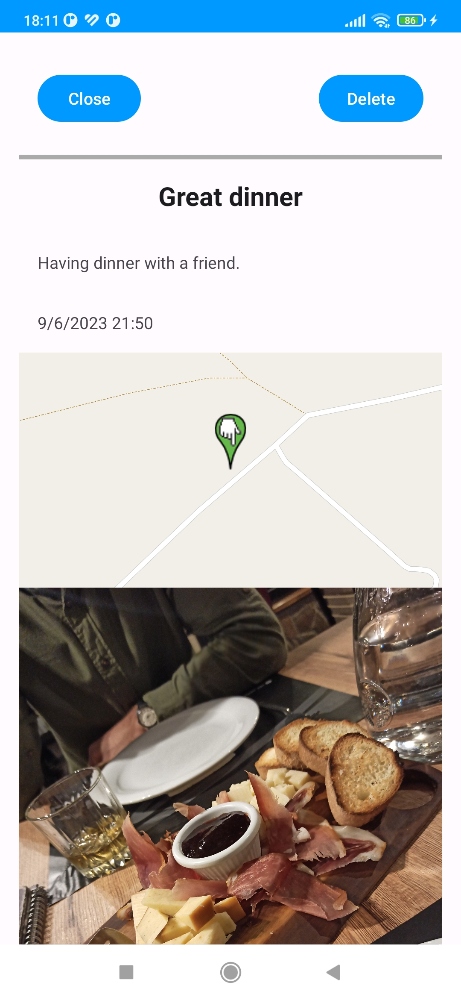

# My Journal

Welcome to My Journal, an Android application designed to help you capture and organize your thoughts, experiences, and memories in one place. With My Journal, you can easily create entries, add photos, and save them securely both locally and on the cloud.

  

## Project Description

My Journal allows users to create journal entries, add existing images from gallery or capture them with the camera, and store them locally on their device using Android Room. Additionally, it integrates Firebase services for authentication, cloud storage, real-time database, messaging, and analytics.

### Mandatory

- [X] Add more views and activities
- [X] Responsiveness for phones and tablets
- [X] Responsiveness for landscape and portrait
- [x] Localization for Macedonian and English
- [x] All strings in XML file
- [X] Save local data to local database with Android Room
- [X] Firebase Authentication (Anonymous, Email & Password, Gmail, FB)
- [X] Firebase Firestore
- [X] Firebase Messaging
- [X] Firebase Analytics

### Optional
- [ ] Custom backend
- [X] Firebase Cloud Functions
- [X] Use phone hardware (camera, sensors, gps)
- [ ] Post on Playstore

### Extra
- [X] Firebase Storage
- [X] OpenStreetMap
- [x] Glide

## Screenshots

| |  | 
| --- | --- | --- |

| |  | 
| --- | --- | --- |

| |  | 
| --- | --- | --- |

| |  | 
| --- | --- | --- |

|
| --- |

## Videos
| <video src="https://github.com/DavidTalevski/FIKT-PMP/assets/58443846/b1c57a48-36ce-43fc-bbde-0e786b8d99e1">  | <video src="https://github.com/DavidTalevski/FIKT-PMP/assets/58443846/93e239fd-22c0-4976-b639-ef3544f8f91a">|
| --- | --- |
